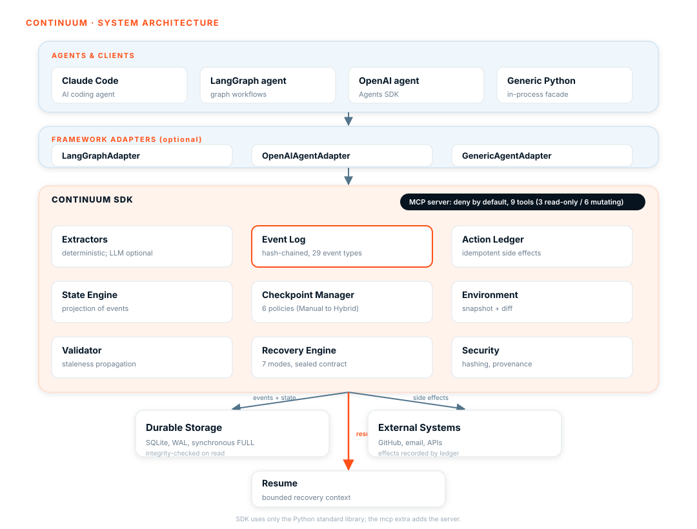
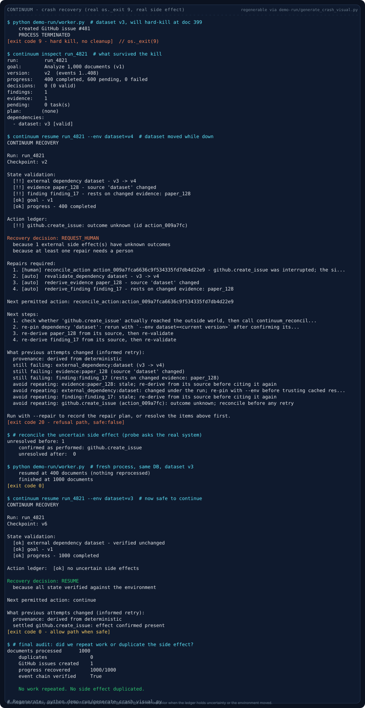

<p align="center">
  
</p>

<p align="center">
  <strong>CONTINUUM: Recuperación semántica verificable para agentes de IA de larga duración.</strong>
  Checkpoints semánticos (no volcados de conversación), un libro mayor idempotente de acciones
  que rechaza efectos secundarios duplicados, y un registro de eventos encadenado y a prueba de manipulaciones,
  todo expuesto como un servidor MCP que deniega por defecto. Agnóstico al framework, Python 3.11+.
</p>

<p align="center">
  <a href="https://www.python.org/downloads/"></a>
  <a href="https://pypi.org/project/continuum-agent/"></a>
  <a href="LICENSE"></a>
  <a href="https://pydantic.dev"></a>
  <a href="https://continuum-nu-six.vercel.app/"></a>
  <a href="https://github.com/Cyrax321/CONTINUUM/actions/workflows/ci.yml"></a>
  <a href="https://app.codecov.io/gh/Cyrax321/CONTINUUM"></a>
</p>

<p align="center" style="margin-bottom: 6px;">
  <a href="https://continuum-nu-six.vercel.app/"><strong>Visita el sitio web de CONTINUUM</strong></a>
</p>

<p align="center" style="margin-top: 6px;">
  <a href="https://app.ona.com/#https://github.com/Cyrax321/CONTINUUM"></a>
</p>

<p align="center">
  <sub>Si CONTINUUM ayuda a tus agentes a recuperarse, por favor dale una estrella al repositorio. Ayuda a otros a descubrirlo y mantiene las buenas first issues llegando.</sub>
</p>

<p align="center">
  <sub><a href="README.md">English</a> | <a href="README.zh-CN.md">简体中文</a> | <strong>Español</strong></sub>
</p>

---

## Contenidos

[Por qué](#por-qué) · [Inicio rápido](#inicio-rápido) · [Cómo funciona](#cómo-funciona) · [Dónde se sitúa CONTINUUM](#dónde-se-sitúa-continuum) · [Características](#características) · [Extensión de seguridad](#extensión-de-seguridad) · [Verificación empírica](#verificación-empírica) · [Integración MCP](#integración-mcp) · [Integración de frameworks](#integración-de-frameworks) · [Conceptos clave](#conceptos-clave) · [Arquitectura](#arquitectura) · [API y CLI](#api-y-cli) · [Hoja de ruta](#hoja-de-ruta) · [Lo que CONTINUUM no es](#lo-que-continuum-no-es) · [Trabajo relacionado](#trabajo-relacionado) · [Estado y limitaciones](#estado-y-limitaciones) · [Contribuir](#contribuir) · [Licencia](#licencia)

---

## Por qué

Los agentes de IA modernos ejecutan tareas largas, con cientos de llamadas LLM, invocaciones de herramientas y escrituras en archivos y bases de datos. Cuando fallan, la respuesta habitual es reproducir todo desde cero, lo que duplica trabajo, duplica efectos secundarios, malgasta tokens y pierde decisiones.

CONTINUUM plantea una pregunta más precisa y más difícil: puede un agente reanudarse desde una representación semántica compacta de su estado de tarea mientras verifica de forma independiente que ese estado sigue siendo válido en el entorno actual? Su diferenciador tiene tres partes:

- **Checkpoints semánticos**: una representación compacta y versionada de lo que el agente necesita para continuar, no un volcado de conversación.
- **Revalidación independiente del entorno**: cada componente del checkpoint se verifica contra el entorno actual antes de reanudar, y la obsolescencia se propaga por el grafo de dependencias.
- **Estado con procedencia**: cada hecho lleva su origen, por lo que el progreso reportado por el agente nunca se auto certifica.

## Inicio rápido

Publicado en PyPI como `continuum-agent` 0.1.0, ejecuta `pip install continuum-agent` (`pip install continuum-agent==0.1.0` para fijar la versión). Las etiquetas de release además adjuntan wheels construidos en [GitHub Releases](https://github.com/Cyrax321/CONTINUUM/releases).

Rutas sin configuración (sin clonar, sin instalar, sin publicar nada):

| Ruta | Cómo |
|:--|:--|
| Instalar desde PyPI | `pip install continuum-agent==0.1.0` y luego `continuum --help` |
| Ver la recuperación tras fallo de principio a fin | `docker run --rm ghcr.io/cyrax321/continuum` |
| Usar la CLI a través de Docker | `docker run --rm ghcr.io/cyrax321/continuum continuum --help` |
| Ejecutar la CLI sin clonar | `uvx --from git+https://github.com/Cyrax321/CONTINUUM.git continuum --help` |
| Windows PowerShell (desde un clon) | `powershell -ExecutionPolicy Bypass -File .\try-it.ps1` o `powershell -ExecutionPolicy Bypass -File .\try-it.ps1 cli --help` |
| Entorno de desarrollo completo en el navegador | [](https://codespaces.new/Cyrax321/CONTINUUM?quickstart=1) |

La imagen Docker se publica en GHCR por CI en cada push a `main` y en cada etiqueta de release (`.github/workflows/docker-publish.yml`). El Codespace se define en `.devcontainer/`.

```bash
git clone https://github.com/Cyrax321/CONTINUUM.git
cd CONTINUUM

uv venv && source .venv/bin/activate     # macOS / Linux; Windows: .venv\Scripts\activate

# Colaboradores (recomendado): librería + CLI + todas las herramientas de test + cada adaptador
uv pip install -e ".[dev]"

# O elige solo lo que necesitas: . (mínimo), [mcp], [otel], [langgraph],
# [openai], [langchain], [attest], [postgres]

# O sáltate el clon por completo:
uv pip install git+https://github.com/Cyrax321/CONTINUUM.git
uv pip install "continuum-agent[mcp] @ git+https://github.com/Cyrax321/CONTINUUM.git"
```

> **Alternativa con pip:** reemplaza `uv pip install` por `pip install` en cada comando anterior.

Verifica:

```bash
continuum --help                 # punto de entrada CLI
continuum-mcp --help             # punto de entrada servidor MCP (necesita [mcp] o [dev])
pytest -q                        # ~1,380 tests recogidos (el número exacto y los saltos varían por entorno)
ruff check src/ tests/ examples/ && ruff format --check src/ tests/ examples/
mypy src/continuum               # las tres puertas que CI exige
```

La librería central tiene una sola dependencia de runtime (`pydantic>=2.7`), todo lo demás es opcional. El mapa completo de paquetes, la matriz de extras, la configuración de tests de Postgres y la verificación por comando están en [references/install.md](references/install.md).

### Conecta un agente de código en dos minutos

Para Claude Code, Gemini CLI o Codex, no escribes Python y no necesitas archivo de prompts:

```bash
continuum start my-task --goal "Qué debe hacer el agente"
continuum hooks install claude-code --with-gate   # también: gemini, codex
```

Desde entonces cada archivo que el agente escribe se captura como evidencia encadenada, su sesión arranca con un briefing automático de estado, los efectos secundarios no declarados registrados en `.continuum/gate.json` se rechazan antes de ejecutarse, y una sesión fresca tras cualquier caída se reanuda con pasos siguientes ejecutables. No se necesita CLAUDE.md.

Ejemplo mínimo de librería, registro y recuperación:

```python
from continuum import EventType, Run, SQLiteStorage, project

store = SQLiteStorage("agent.db")
store.create_run(Run(run_id="run_4821", goal="Analizar 10,000 documentos"))
store.append_event("run_4821", EventType.RUN_STARTED, {"goal": "Analizar 10,000 documentos", "total": 10_000})

for i, doc in enumerate(documents):
    analyze(doc)
    store.append_event("run_4821", EventType.WORK_COMPLETED, {"doc": i})

# Tras una caída, un proceso nuevo retoma exactamente donde se detuvo:
state = project("run_4821", store.read_events("run_4821"))
print(state.progress.completed)            # ya hecho, no se repite
print(store.verify_events("run_4821").ok)  # True, cadena intacta tras la caída
```

**Ejecuta la prueba tú mismo:**

```bash
python examples/crash_recovery_agent.py   # muerte real del proceso, efecto secundario real
python examples/context_compaction.py     # transcripción perdida, checkpoint sobrevive
python examples/model_switch.py           # Modelo A muere, Modelo B retoma de forma segura
python scripts/mcp_smoke.py               # subproceso real, tráfico JSON-RPC real
```

El kit `e2e-autonomy-test/` guioniza una tarea real de lotes de facturas, una muerte brusca a mitad de ejecución y una sesión fresca de reanudación, luego puntúa el outbox, el libro mayor y la cadena de eventos fuera de banda. La ejecución 1 obtuvo **7/7 en mecánicas** contra una sesión real de Claude Code. Recorrido completo en [references/e2e.md](references/e2e.md).

## Cómo funciona

CONTINUUM separa el **contexto LLM** (temporal) del **estado duradero de la tarea** (permanente). En lugar de guardar el historial de conversación, construye un checkpoint semántico, la mínima información verificada necesaria para continuar.



La explicación detallada, el modelo de proyección y el contexto de recuperación están en [references/architecture.md](references/architecture.md).

## Dónde se sitúa CONTINUUM

Cuatro preocupaciones se solapan en cada agente de larga duración. CONTINUUM solo es dueño de la última y toca las otras tres a través de costuras explícitas. No se nombra a ningún competidor y no se hace ninguna afirmación sin un módulo entregado o una suite publicada que ya lo imprima.

| Capa | Responde | Cómo se conecta (módulos entregados o salidas publicadas) |
|:--|:--|:--|
| Harness | Cómo el agente llama a herramientas y avanza hacia un objetivo? | Fuera de CONTINUUM. Puntos de conexión entregados en `src/continuum/adapters/generic.py` (`GenericAgentAdapter`), `src/continuum/adapters/thin.py` (hooks de CrewAI, AutoGen, Pydantic AI), `src/continuum/mcp/server.py` (MCP stdio), `src/continuum/hooks.py` y `src/continuum/clienthooks.py` (hooks de ciclo de vida de CLI de código), `src/continuum/gateway.py` (proxy HTTP de cumplimiento para cualquier lenguaje) y `src/continuum/otel.py` (puente OpenTelemetry). Recetas en `docs/recipes/` y `references/adapters.md`. |
| Ejecución durable | Qué pasó antes de una caída y qué puede reproducirse sin perder trabajo? | Registro de eventos encadenado `src/continuum/events.py` con `verify()` y `trusted_through`, almacenamiento durable `src/continuum/storage/sqlite.py` (WAL, `synchronous=FULL`, schema v6) y `src/continuum/storage/postgres.py` más `src/continuum/storage/migrations.py`, checkpoints dirigidos por políticas `src/continuum/checkpoint/manager.py` y `src/continuum/checkpoint/policy.py` que reproducen el hueco en `restore()`. Recorrido en `docs/recovery_walkthrough.md` (salida de `examples/recovery_walkthrough.py`). |
| Plano de control | Qué ejecución está activa, quién puede actuar sobre ella y a dónde va la salida? | Registro de ejecuciones y jerarquía padre/hijo `src/continuum/storage/` y `src/continuum/recovery/family.py` (`continuum tree`), autorización allowlist `src/continuum/mcp/authz.py` (`CONTINUUM_MCP_MUTATING_CLIENTS` / `CONTINUUM_MCP_TOKEN`), superficies de presentación `src/continuum/dashboard/app.py` y `src/continuum/serve/server.py`, CLI `src/continuum/cli/main.py` (`continuum runs`, `continuum tree`, `continuum health`). |
| Sustrato de verificación | Dado el checkpoint en el tiempo T y el mundo tal como está ahora, sigue siendo seguro y correcto continuar? | `src/continuum/state/validator.py` (obsolescencia `dependency -> evidence -> finding -> decision` más `PlanStep.depends_on`), `src/continuum/provenance_map.py` (`Origin` a `REQUIRES_REVIEW` hasta `REVIEW_CONFIRMED`), `src/continuum/actions/ledger.py` con `src/continuum/actions/idempotency.py` y `src/continuum/gate.py` / `src/continuum/gateway.py` (reclamar antes de ejecutar, rechaza duplicados, lanza `UnknownSideEffect` para reconciliación), `src/continuum/replayguard.py` (guardia portable), `src/continuum/pinning.py` y `src/continuum/replay_similarity.py` (corrección de reproducción), `src/continuum/budgets.py` (límites de reintentos), `src/continuum/recovery/engine.py` + `src/continuum/recovery/contract.py` + `src/continuum/recovery/planner.py` + `src/continuum/recovery/observations.py` (severidad máxima `RESUME < ... < ABORT`, contrato sellado con `evidence` / `reason` / `next_allowed_action` / `human_steps`), `src/continuum/checkpoint/rewind.py` (rebobinado atómico de doble estado), `src/continuum/analysis/prefix_trust.py` (confianza consultiva). Comprobaciones publicadas: `docs/recovery_walkthrough.md`, `benchmarks/fault_injection/` (suite que imprime `detection_rate` / `unsafe_resume_rate`), `src/continuum/benchmark/phase6/` (suite de corrección de recuperación), `docs/RESULTS.md` y el visual regenerable de abajo. |

Cada fila de arriba es rastreable a una ruta que existe en `main` en el commit etiquetado. Nada en esta tabla vuelve a exponer un número de benchmark, los benchmarks solo viven en la salida de la suite que ya los imprime. Consulta `docs/research.md` para la lista completa de suites publicadas y documentos de diseño.

### Recuperación tras caída, de verdad

La imagen de abajo no es una maqueta. Es la salida de `python demo-run/generate_crash_visual.py`, que ejecuta `demo-run/worker.py` hasta `os._exit(9)` en el documento 399, llama a `continuum resume --env dataset=v4` y muestra la ruta de rechazo (`REQUEST_HUMAN`, `safe:false`, exit 20), reconcilia el efecto secundario incierto con una sonda, luego se reanuda desde la misma base de datos y termina sin trabajo duplicado. La transcripción también se guarda como `docs/assets/crash-recovery.txt` para auditoría.

Regenerarlo:

```bash
python demo-run/generate_crash_visual.py
# o: python scripts/generate_crash_visual.py
```



Recorrido completo con código en `docs/recovery_walkthrough.md` (`examples/recovery_walkthrough.py`). El harness mínimo de bench está en `references/bench.md` (`continuum benchmark`).

## Características

| Capacidad | Qué te aporta |
|:--|:--|
| Checkpoints semánticos | Estado compacto, versionado e inspeccionable, no un volcado de transcripción |
| Libro mayor idempotente | Rechaza efectos secundarios externos duplicados, expone los inciertos para reconciliación |
| Revalidación del entorno | Cada componente del checkpoint se verifica contra el mundo actual antes de reanudar |
| Estado con procedencia | El progreso reportado por el agente se marca `REQUIRES_REVIEW`, nunca se auto certifica |
| Motor de recuperación | Siete modos de recuperación con un contrato determinista y sellado para la siguiente acción |
| Servidor MCP que deniega por defecto | Once herramientas, separación lectura/mutación, allowlist de llamantes |
| Adaptadores de frameworks | Integraciones Python genérico, OpenAI Agents SDK, LangGraph y LangChain |
| Bucle de planificación seguro | La verificación de observaciones con dos señales escala ramas de alto riesgo a REQUIRES_REVIEW |
| Revalidación periódica | El entorno se vuelve a comprobar según agenda, detectando deriva a mitad de ejecución dentro de un ciclo |
| Registro a prueba de manipulaciones | Registro de eventos encadenado (36 tipos de eventos) con verificación de integridad |
| Puerta de cumplimiento | Llamadas a efectos secundarios no reclamadas se rechazan antes de ejecutarse, los mensajes de denegación enseñan el protocolo de reclamo |
| Hooks de observación | Cada archivo que una CLI de código escribe se convierte en evidencia verificada por digest, fuera del control del modelo |
| Briefing de sesión | Sesiones frescas aprenden el estado de la ejecución de forma determinista al inicio, incluido el resumen de razonamiento de la sesión anterior |
| Sondas reconciliadoras | Comandos registrados liquidan efectos secundarios inciertos automáticamente, los humanos solo ven el resto |
| Guía ejecutable | Resume y validate renderizan los siguientes pasos como comandos ejecutables, no como estados |
| Gateway HTTP de cumplimiento | Llamadas salientes en cualquier lenguaje requieren reclamos, las respuestas se liquidan desde el código de estado real |
| Puente OpenTelemetry | Los spans de llamadas a herramientas del tracing de producción se convierten en evidencia sin cambios de código |
| Índice de acciones | Las búsquedas de idempotencia entre ejecuciones son lecturas indexadas, no escaneos completos |
| Fijación de versiones | Hashes de prompt, herramienta y modelo afirmados por el llamante se almacenan por reclamo, la deriva aflora al reanudar |
| Presupuestos de reintentos | Límites de intentos por tipo de acción impuestos al reclamar, los agentes ven los intentos restantes |
| Padre/hijo multiagente | La reanudación del padre compone el peor estado de la familia, el hijo incierto bloquea al padre |
| Reintento informado | Resúmenes de fallo redactados por el motor se inyectan en reanudaciones posteriores a la recuperación |
| Semántica de bifurcación | Continuaciones divergentes se ramifican en ejecuciones hijas con autoridad fresca |
| Compactación de registro | El prefijo pre-ancla se archiva verbatim, el registro vivo permanece acotado para ejecuciones de meses |
| Seguimiento de concesiones consumidas | Referencias de autoridad de un solo uso se marcan como gastadas en estado terminal, la reutilización tras restaurar se rechaza (`GRANT_DENIED`), defendiendo la ruta de restauración contra resurrección de autoridad |
| Atestación de cadena | `continuum attest` firma la cabeza de cadena de una ejecución con Ed25519 para que un verificador externo pueda probar que el historial no fue alterado con una clave conocida |
| Superficie HITL del dashboard | Botones de confirmar, reconciliar y completar con paridad de auditoría respecto a la CLI |

## Extensión de seguridad

Dos extensiones de seguridad aditivas se asientan sobre el sustrato de recuperación y checkpoint. No cambian la reanudación, la reproducción ni la ruta existente de revalidación en el momento de la caída.

- **Bucle de planificación seguro**: las observaciones llevan procedencia y se verifican con dos señales independientes (`verified` / `unverified` / `contested`). Una rama del plan protegida por una observación no verificada o disputada se escala a `REQUIRES_REVIEW`. Las decisiones se añaden al libro mayor como eventos `PERCEPTION_OBSERVED` y `BRANCH_RESOLVED`.
- **Revalidación periódica**: reutiliza el motor de recuperación en un intervalo de pasos (por defecto 25) y al cambiar de aplicación, por lo que la deriva del entorno a mitad de ejecución se detecta dentro de un ciclo en lugar de solo en la próxima caída.

Consulta [docs/PROBLEM.md](docs/PROBLEM.md), [docs/RESULTS.md](docs/RESULTS.md) y [STATUS.md](STATUS.md).

## Verificación empírica

CONTINUUM se verifica contra agentes LLM reales, límites de protocolo en vivo y caídas duras de proceso, no solo tests unitarios con mocks.

- **Agentes reales**: lotes de facturas multi sesión con Claude Code con `SIGKILL` a mitad de ejecución, puntuados 7/7 en mecánicas, las sesiones reanudadas consultaron `continuum_resume`, enrutaron efectos secundarios por el libro mayor en dos fases, se negaron a duplicar escrituras verificadas y respetaron `request_human`. Las pruebas en vivo expusieron huecos de deduplicación por deriva de prompt, cerrados con normalización de ruta canónica y respaldo basado en tokens en `ActionLedger.claim()`.
- **Clientes de terceros**: Gemini CLI y Kilo Code conectados vía stdio JSON-RPC contra el almacén SQLite en vivo, validando coexistencia multiagente y aislamiento de autorización.
- **Cumplimiento de protocolo**: conducido de extremo a extremo con `@modelcontextprotocol/inspector --cli` a través de muertes de proceso, las herramientas mutantes deniegan por defecto tras `CONTINUUM_MCP_MUTATING_CLIENTS`, los reclamos externos degradan a `REQUIRES_REVIEW` (`safe: false`).
- **Auto reparación**: servidores matados de forma brusca se recuperan de sidecars huérfanos `-wal`/`-shm` de SQLite mediante limpieza de un solo reintento al arrancar.
- **Escala**: cerca de 1,380 tests recogidos (~1,360 pasando, el resto se salta sin servicios opcionales) en Python 3.11, 3.12 y 3.13 (unitarios, basados en propiedades con `hypothesis`, concurrencia, adversariales). CONTINUUM-Bench ejecuta cinco escenarios de caída más un escenario dedicado de deriva de argumentos, midiendo 0 trabajo duplicado y 0 efectos secundarios duplicados para CONTINUUM frente a duplicación total para la reproducción ingenua, más una suite separada de 12 escenarios de corrección de recuperación (`continuum.benchmark.phase6`) que codifica los puntos de caída del estudio de ejecución durable como aserciones ejecutables.
- **Auditoría adversarial**: la superficie MCP completa fue auditada sobre el protocolo en vivo, se encontraron y corrigieron tres defectos. Método y pasos de reproducción en [test.md](test.md).

## Integración MCP

CONTINUUM entrega un servidor MCP para que un agente pueda registrar progreso, hacer checkpoint y enrutar efectos secundarios externos por el libro mayor sin embeber la librería:

```bash
uv pip install -e ".[mcp]"
CONTINUUM_MCP_MUTATING_CLIENTS=your-client-name continuum-mcp
```

Once herramientas vía stdio. Tres son de solo lectura (`continuum_validate`, `continuum_resume`, `continuum_list_actions`), ocho mutan. Los efectos secundarios son en dos fases (reclamar, ejecutar, completar) y las herramientas mutantes deniegan por defecto tras una allowlist. El estado reportado por el agente se registra con procedencia `Origin.EXTERNAL_AGENT` y se marca `REQUIRES_REVIEW`.

Detalles de verificación, incluida la recuperación tras caída al arrancar y la prueba extremo a extremo con Claude Code, en [references/mcp.md](references/mcp.md). Si un servidor registrado reporta `CONNECTION_CLOSED`, la causa casi siempre es la resolución de `PATH` y no el servidor en sí: [docs/api/mcp.md](docs/api/mcp.md#troubleshooting) tiene el diagnóstico y dos remedios.

## Integración de frameworks

Nueve adaptadores se entregan en `src/continuum/adapters/` (una fachada en proceso más ocho integraciones), todos instalables de forma opcional para que el núcleo siga siendo solo de la librería estándar:

| Adaptador | Clase | Notas |
|:--|:--|:--|
| Agente Python genérico | `GenericAgentAdapter` | Fachada en proceso, escribe estado confiable (`Origin.DETERMINISTIC`). |
| Sandbox de sistema de archivos | `FilesystemSandboxAdapter` | Sandbox de directorio local, sin servicio externo, valor por defecto para docs y CI. |
| Python en proceso | `PythonInProcAdapter` | Ejecuta Python en un directorio de trabajo temporal, registra vía libro mayor. |
| Contenedor | `ContainerAdapter` | Respaldado por Docker, salto protegido cuando `docker` falta. |
| Navegador | `BrowserAdapter` | Respaldado por Playwright, salto protegido cuando no está instalado. |
| Kubernetes | `KubernetesAdapter` | Respaldado por `kubectl`, salto protegido cuando no está configurado. |
| OpenAI Agents SDK | `OpenAIAgentAdapter` | Experimental. Engancha `ToolContext` / `RunHooks`, opcional `openai-agents`. |
| LangGraph | `LangGraphAgentAdapter` | Experimental. Envuelve un `StateGraph`, opcional `langgraph`. |
| LangChain | `LangChainAgentAdapter` | Experimental. Deja `checkpoint_node` en un pipeline `Runnable` de LCEL y en el bucle de llamada a herramientas de `create_agent`, opcional `langchain`. |

Cada adaptador registra progreso vía el libro mayor y enruta efectos externos por el protocolo de dos fases de intercepción y completado. Los tres adaptadores de framework tienen tests de integración extremo a extremo y han sido conducidos contra un **modelo vivo de OpenRouter**, donde las ejecuciones expusieron y cerraron una brecha de deduplicación por deriva de argumentos de LLM y dos defectos del adaptador de OpenAI, incluido un hard crash vivo (`os._exit(137)` en mitad de efecto secundario) por adaptador. Uso completo, resultados con modelo vivo y ejemplos ejecutables para cada adaptador en [references/adapters.md](references/adapters.md).

Las apps de producción con LangGraph también pueden mantener su API de persistencia nativa: `make_continuum_checkpointer(storage)` implementa `BaseCheckpointSaver` de LangGraph sobre el almacenamiento de CONTINUUM, por lo que cada put aterriza en el mismo registro de eventos encadenado y con procedencia (ver [references/adapters.md](references/adapters.md)).

Otras tres frameworks de producción están cubiertos por superficies delgadas de hooks sin SDK en [`adapters/thin.py`](src/continuum/adapters/thin.py):

| Framework | Superficie de intercepción | Punto de entrada |
|:--|:--|:--|
| CrewAI | hooks globales antes/después de llamada a herramienta | `install_crewai_hooks(storage, run_id)` |
| AutoGen core | `FunctionTool.run_json` envuelto en el sitio | `wrap_autogen_tool(tool, storage, run_id)` |
| Pydantic AI | capacidad asíncrona de Hooks | `Agent(capabilities=[wrap_pydantic_ai_hooks(storage, run_id)])` |

Para stacks que ninguno de estos alcanza: `continuum gateway` impone reclamos en HTTP saliente desde cualquier lenguaje, `continuum.otel.make_span_processor(storage)` convierte spans existentes de OpenTelemetry de herramientas en evidencia, y `continuum serve` expone las mismas operaciones que las herramientas MCP sobre un protocolo de cable JSON agnóstico al lenguaje (stdio, o HTTP vía `--transport http` con autenticación `CONTINUUM_SERVE_TOKEN`).

### Reanudando ejecuciones reportadas por agente o MCP

El estado reportado vía MCP, o a través del adaptador de OpenAI, lleva procedencia `Origin.EXTERNAL_AGENT` y se resuelve a `request_human` hasta confirmarse. Las ejecuciones de LangGraph y LangChain usan `Origin.DETERMINISTIC` y se reanudan directamente. Para limpiar la revisión y reanudar:

```bash
continuum confirm <run_id>   # registra REVIEW_CONFIRMED, luego reevalúa
continuum resume <run_id>    # ahora reporta RESUME
```

Sobre MCP el equivalente es la herramienta `continuum_confirm` seguida de `continuum_resume`. La confirmación es un evento único y atestiguado por humano: la escotilla de escape para la seguridad de auto certificación, por lo que una ejecución dirigida externamente nunca queda atascada de forma permanente.

## Conceptos clave

La referencia profunda para cada concepto vive en [references/concepts.md](references/concepts.md).

- **Checkpoints semánticos**, una representación compacta y versionada de lo que el agente necesita para continuar.
- **Validación de estado**, cada componente verificado de forma independiente, la obsolescencia se propaga por el grafo de dependencias.
- **Libro mayor idempotente**, los efectos secundarios externos se rastrean y deduplican, los resultados inciertos lanzan en lugar de reintentar silenciosamente.
- **Modos de recuperación**, `RESUME`, `REPAIR_AND_RESUME`, `ROLLBACK`, `WAIT`, `REQUEST_HUMAN`, `ABORT` (más `REPLAN`).
- **Contrato de recuperación**, una siguiente acción determinista, sellada por integridad y protegida.

## Arquitectura

CONTINUUM se organiza en torno a un invariante: **cada hecho lleva su origen, y la confianza se gana, nunca se asume.** Por qué importa para una startup: un agente que corre durante semanas no debe perder trabajo cuando su contexto se pierde, y no debe malgastar tokens, coste o disparar una herramienta dos veces.

### Sistema de un vistazo, adaptador universal, un registro, cualquier harness

Cualquier harness se conecta al mismo registro encadenado. La misma ejecución puede ser escrita por Claude Code, reanudada por LangGraph, inspeccionada por la CLI y aprobada en el dashboard. No se requiere cooperación del framework.

```text
  Claude Code ─┐
  Gemini CLI ──┤
  Codex ───────┤
  LangGraph ───┼── 5 costuras ──►  Un registro durable  ──►  Recuperación + Dashboard + CLI
  LangChain ───┤                (encadenado,        (contrato sellado,
  OpenAI SDK ──┤                 con procedencia,     verificación, salud,
  CrewAI ──────┤                 exactamente una vez)  familia)
  Cualquier HTTP ──┤
  Cualquier app OTel ┘

  Costuras: 1 En proceso  2 MCP  3 Hooks CLI  4 Gateway  5 OTel
```

### Las tres garantías (la demo prueba cada una)

1. **Sin auto certificación.** El estado reportado por el agente es `EXTERNAL_AGENT` y degrada a `REQUIRES_REVIEW` hasta un `REVIEW_CONFIRMED` humano. Solo escritores confiables producen estado `DETERMINISTIC`.
2. **Los efectos secundarios requieren reclamos.** Cada efecto externo se reclama en un libro mayor idempotente antes de dispararse. Los efectos no reclamados se bloquean en el límite, los duplicados se rechazan, los resultados inciertos se elevan para reconciliación.
3. **La recuperación verifica contra la realidad.** La reanudación comprueba digests de archivos, versiones de dependencias e identidad del modelo antes de decir que es seguro. La obsolescencia se propaga `dependency -> evidence -> finding -> decision` más `PlanStep.depends_on` por lo que solo los pasos afectados se reparan.

### Cinco costuras de integración

| Costura | Cómo conectar | Qué te aporta |
|:--|:--|:--|
| 1 En proceso | `GenericAgentAdapter.intercept_action(...)` y `wrap_tool(key_fn=...)` en LangChain, LangGraph, OpenAI Agents SDK | Frameworks Python, escrituras confiables |
| 2 Servidor MCP | `continuum-mcp` 12 herramientas vía stdio (`continuum_record_progress`, `continuum_intercept_action`, `continuum_complete_action`, etc.) | Cualquier cliente capaz de MCP, 3 solo lectura + 8 mutantes, allowlist `CONTINUUM_MCP_MUTATING_CLIENTS` |
| 3 Hooks de ciclo de vida CLI | `continuum hooks install claude-code --with-gate` también `gemini` y `codex` | CLIs de código: `SessionStart briefing`, `PostToolUse observe`, `PreToolUse gate`, sin necesidad de CLAUDE.md |
| 4 Gateway HTTP de cumplimiento | `continuum gateway --port 8765` con `.continuum/gateway.json` | Cualquier lenguaje, cualquier HTTP saliente debe tener un reclamo, el gateway liquida desde el código de estado real |
| 5 Puente OpenTelemetry | `make_span_processor(storage)` | Cualquier app trazada, los spans se convierten en evidencia `TOOL_COMPLETED` |

Superficies delgadas de hooks para CrewAI, AutoGen, Pydantic AI viven en `adapters/thin.py` sin necesidad de SDK.

### Pipeline de cumplimiento, por qué sin duplicados y sin llamadas inválidas

El pipeline de puerta a observación cierra la brecha en el límite del harness. Esto es lo que ahorra tokens y coste y bloquea llamadas inválidas a herramientas.

```text
Hook PreToolUse                    Hook PostToolUse
    |                                    |
    v                                    v
continuum gate                    continuum observe
    |                                    |
    |-- sin reclamo? DENIEGA (exit 2)          |-- evento TOOL_COMPLETED:
    |   + instrucciones para reclamar          |     ruta, bytes, sha256 en disco ahora
    |                                    |
    |-- reclamo vivo? PERMITE                |-- estado verificado en disco:
    |                                    |     verificado / cambiado / faltante
    v
el agente ejecuta el efecto
    |
    v
continuum_complete_action  (liquidado desde la realidad, no desde el reporte)
    |
    v
libro mayor marcado COMPLETADO, la próxima reproducción devuelve resultado cacheado, no un segundo disparo
```

Host desconocido se deniega cerrado por fallo, no como relay abierto. Shell `Bash/curl` es el punto ciego documentado de v1.
