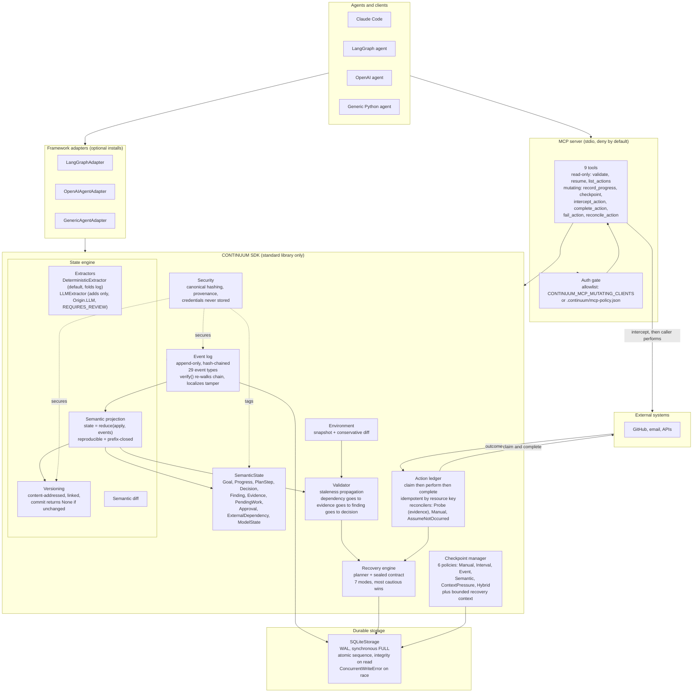
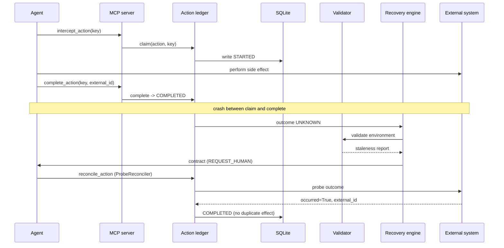

# CONTINUUM architecture diagram

A complete view of the system: agents and clients, the framework adapters, the
deny-by-default MCP server, the SDK internals (state engine, event log, action
ledger, checkpointing, validation, recovery engine, security), the semantic
state data model, durable storage, and the external systems a run acts on.

## System architecture

## Enumerated reference (complete data)

| Item | Values |
|:--|:--|
| **MCP tools (9)** | Read-only (3): `validate`, `resume`, `list_actions`. Mutating (6): `record_progress`, `checkpoint`, `intercept_action`, `complete_action`, `fail_action`, `reconcile_action`. |
| **Recovery modes (7)** | `RESUME`, `REPAIR_AND_RESUME`, `REPLAN`, `WAIT`, `REQUEST_HUMAN`, `ROLLBACK`, `ABORT`. Precedence (most cautious wins): `RESUME -> REPAIR_AND_RESUME -> REPLAN -> WAIT -> REQUEST_HUMAN -> ROLLBACK -> ABORT`. |
| **Checkpoint policies (6)** | `ManualPolicy`, `IntervalPolicy`, `EventPolicy`, `SemanticPolicy`, `ContextPressurePolicy`, `HybridPolicy` (default). |
| **Action ledger reconcilers (3)** | `ProbeReconciler` (asks external system, produces evidence), `ManualReconciler` (escalates), `AssumeNotOccurredReconciler` (requires explicit `idempotent=True`). Deliberately no `AssumeOccurred`. |
| **SemanticState fields (10)** | `Goal`, `Progress`, `PlanStep[]`, `Decision[]`, `Finding[]`, `Evidence[]`, `PendingWork[]`, `Approval[]`, `ExternalDependency[]`, `ModelState`. |
| **Event types (29)** | Including `RUN_STARTED`, `TOOL_CALLED`, `DECISION_CREATED`, `STATE_CHECKPOINTED`, `ENVIRONMENT_CHANGED`, `RECOVERY_STARTED`, `ACTION_RECONCILED`, `WORK_COMPLETED`, `RUN_COMPLETED`, and 20 more across the full lifecycle. |
| **Action states** | `PLANNED`, `STARTED`, `COMPLETED`, `FAILED`, `UNKNOWN`, `COMPENSATED`, `REQUIRES_REVIEW`. |
| **Storage guarantees** | Append-only events, atomic sequence allocation, durability on `append_event` return, WAL journaling, `synchronous=FULL`, corruption refused on read (`CorruptedRecord`), loud write races (`ConcurrentWriteError`). No exactly-once (the ledger reconciles the gap). |
| **Framework adapters (3)** | `GenericAgentAdapter` (in-process, trusted `Origin.DETERMINISTIC`), `OpenAIAgentAdapter` (OpenAI Agents SDK), `LangGraphAdapter` (wraps a `StateGraph`). |
| **Provenance / origin** | Every state component traces to its origin event: `Origin.DETERMINISTIC`, `Origin.EXTERNAL_AGENT` (marked `REQUIRES_REVIEW`), `Origin.LLM`. |

## Recovery data flow

